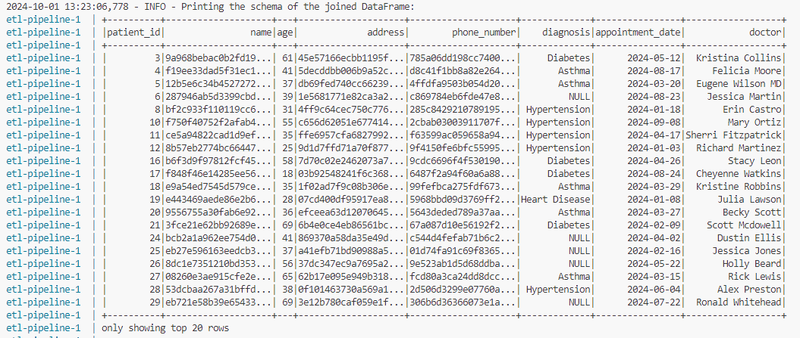
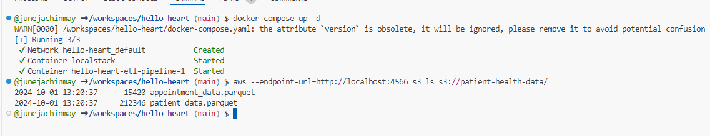

# ETL Pipeline for Patient-Health Data Processing

This project implements an ETL (Extract, Transform, Load) pipeline using Python, PySpark, Docker, and LocalStack for simulating AWS S3 service. The pipeline processes patient and appointment data, standardizes the information, de-identifies sensitive fields, and uploads the processed data to the simulated S3 bucket. It utilizes PySpark to join and display the processed data.

## Prerequisites

- Docker
- Docker Compose
- Python 3.x
- pip

## Features

- Data ingestion from CSV files
- Phone number and address standardization
- Sensitive data de-identification using SHA-256 hashing
- Parquet file generation for efficient storage
- Integration with LocalStack for S3-compatible storage
- Data processing and joining using Python and PySpark

## Project Structure

├── Dockerfile
├── docker-compose.yaml
├── etl_pipeline.py
├── requirements.txt
├── appointment_data.csv
└── patient_data.csv
├── s3-bucket.png   # Screenshot of parquet files in simulated s3 bucket
├── output-dataframe.png # Screenshot of final data frame

## Dockerfile

The Dockerfile sets up a Python environment, installs required dependencies (including Java for PySpark and Hadoop), and prepares the application for execution.

## docker-compose.yaml

The Docker Compose file defines two services:

- localstack: Simulates AWS services.
- etl-pipeline: Builds the ETL pipeline service from the Dockerfile.

  etl-pipeline service depends on the localstack service, ensuring that LocalStack starts before the ETL pipeline runs.

## etl_pipeline.py

The main ETL pipeline code that:

 - Reads CSV files
 - Standardizes and de-identifies data
 - Saves the processed data as Parquet files
 - Uploads data to LocalStack S3
 - Uses PySpark to join and display data

## Pipeline Functions

1. **phone_number_standardization(phone)**: Standardizes phone numbers to the format `+1-XXX-XXX-XXXX`.

2. **address_standardization(address)**: Standardizes addresses by converting them to lowercase and removing extra spaces.

3. **hash_sensitive_information(value)**: Hashes sensitive information (like names, addresses, and phone numbers) using SHA-256.

4. **setup_localstack_s3()**: Sets up a connection to LocalStack S3 and creates a bucket named `patient-health-data` if it doesn't already exist.

5. **process_data(patient_file, appointment_file)**: Reads the CSV files, removes duplicates, standardizes fields, and saves the processed data as Parquet files.

6. **upload_to_localstack(s3, parquet_files)**: Uploads the generated Parquet files to the LocalStack S3 bucket.

7. **join_using_pyspark()**: Initializes a PySpark session, reads the Parquet files from S3, and performs an inner join on `patient_id`.

8. **main(patient_file, appointment_file)**: Orchestrates the entire ETL process.

## Usage

### Prepare Data Files

Ensure the two CSV files: `patient_data.csv` and `appointment_data.csv` are in the same directory as the script.

### Run the ETL Pipeline

The pipeline will automatically start upon running the Docker Compose command, processing the data and uploading it to LocalStack

docker-compose up --build

docker-compose down or Press Ctrl+C to stop the running services

## LocalStack

You can access LocalStack using the AWS CLI. Make sure you have awscli installed, if not, you can install using pip install awscli.

Make sure docker services are running

docker-compose up -d

Run the following commands to setup localstack profile

aws configure set aws_access_key_id test
aws configure set aws_secret_access_key test
aws configure set region us-east-1
aws configure set s3.endpoint_url http://localstack:4566

View data on simulated s3 bucket

docker-compose up -d
aws --endpoint-url=http://localhost:4566 s3 ls s3://patient-health-data/

### Logging and Error Handling

The pipeline logs its operations to the console. You can monitor the logs for any errors or warnings that may occur during execution. It also includes error handling for various stages to help troubleshoot any issues that may arise during execution.